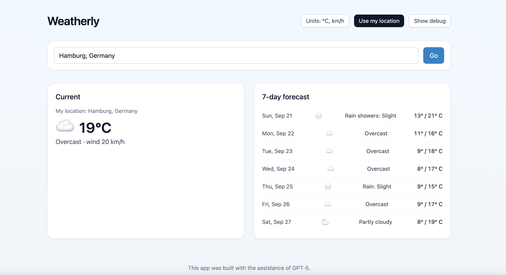

# Weatherly

A clean, fast weather app powered by Open‑Meteo APIs. No API keys required.

## Highlights
- City search with debounced typeahead
- “Use my location” with reverse‑geocoding and robust fallbacks
- Clear current conditions and 7‑day forecast
- Metric/Imperial toggle (°C/km/h ↔ °F/mph)
- Static export suited for GitHub Pages and other static hosts

## Tech Stack
- Next.js 14 (Pages Router) + TypeScript
- Tailwind CSS for styling
- Open‑Meteo: geocoding, reverse geocoding, forecast
- Nominatim (OpenStreetMap) as reverse‑geocode fallback
- Vitest + Testing Library + jsdom for tests

## Getting Started
1) Install dependencies
```bash
npm install
```

2) Start the dev server
```bash
npm run dev
```
Open http://localhost:3000 in your browser.

## Usage Tips
- Geolocation requires a secure context (HTTPS) or localhost. If you open a file URL or plain HTTP on a remote host, the “Use my location” button will show an explanatory error.
- Toggle the optional debug panel via the “Show debug” button to see the last forecast URL, the reverse‑geocode provider used (Open‑Meteo or Nominatim), and the reverse URL. This helps diagnose network issues.

## Testing
This project uses Vitest with Testing Library and jsdom.

Available scripts:
- Run all tests once:
```bash
npm run test
```
- Watch mode during development:
```bash
npm run test:watch
```

What’s covered:
- Unit tests for API utilities (URL builders, weather parsing, reverse‑geocode fallback)
- UI tests for the main page (typeahead suggestions, geolocation success/denied, caret stability while reverse upgrades, footer attribution)

Test setup details:
- `vitest.config.ts` sets the `jsdom` environment and uses `vitest.setup.ts` to add `jest-dom` matchers and a default geolocation mock. Individual tests override `navigator.geolocation.getCurrentPosition` and `global.fetch` as needed.

## Build (Static Export)
This app is configured to statically export (`next.config.js` sets `output: 'export'`). To produce the `out/` directory:
```bash
npm run build
```

You can preview the static output locally with any static file server, for example:
```bash
npx serve out
```

## Deploy
### GitHub Pages (project site)
The repository includes a workflow at `.github/workflows/pages.yml` that builds and deploys the static export. `next.config.js` sets `assetPrefix`/`basePath` automatically for project pages using `REPO_NAME` or `GITHUB_REPOSITORY` (defaults to `weatherly`).

Steps:
1) Push to `main` or `master` to trigger the workflow.
2) In the repo settings, enable Pages with the “GitHub Actions” source (if not already enabled).
3) Your site will be available at:
```
https://<your-username>.github.io/weatherly/
```

### Netlify or other static hosts
Upload the contents of `out/`. If deploying at a path other than `/weatherly`, adjust `basePath`/`assetPrefix` in `next.config.js` (or set them empty for root deploys), rebuild, and redeploy.

## Project Structure (key files)
- `pages/index.tsx` – main UI, search + geolocation, forecast display, debug panel, footer
- `lib/openmeteo.ts` – API helpers (search, reverse with Nominatim fallback, forecast, formatters)
- `types/weather.ts` – Type definitions
- `__tests__/` – Unit and UI tests
- `vitest.config.ts` / `vitest.setup.ts` – Test config and globals setup
- `next.config.js` – Static export and GitHub Pages path settings

## Attribution
The footer includes: “This app was built with the assistance of GPT‑5.”

## Screenshot

```markdown

```
